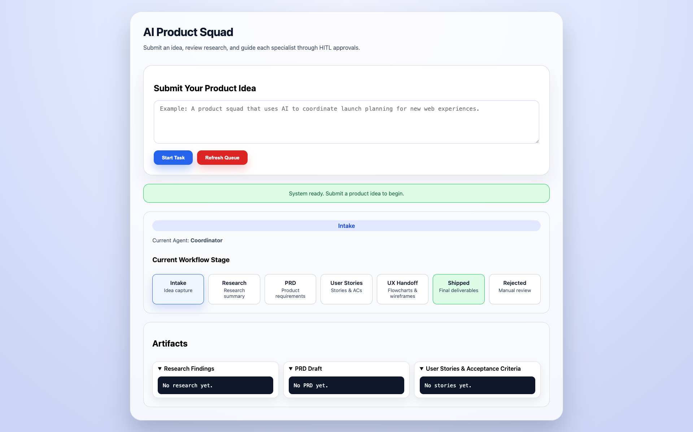

# Workflow & Approval Loop

## End-to-End Flow

The squad follows a serialized, checkpointed sequence. Each node in the LangGraph graph runs once, outputs a structured result, and then pauses for a human approval before continuing. FastAPI endpoints and the UI keep you in sync with the workflow, and the refreshed home page shows a floating intake card, a live status pill, and workflow stage cards so you always know which agent is active.

### 1. Submit an Idea

Navigate to `http://localhost:8000` (served by `index.html`), enter a product idea, and click **"Start Task"**. The hero card displays a response/status message directly beneath the form, so confirmation/error text is immediate. The browser calls `POST /start_task`, which:

1. Generates a UUID `task_id`.
2. Saves a new row to `tasks.db` with `status="starting"`.
3. Triggers the LangGraph workflow with `thread_id=task_id` via `AsyncSqliteSaver`.

The initial task record appears immediately on `tasks_dashboard` (`tasks.html`), which polls `GET /tasks` every five seconds. The intake page also checks `GET /get_pending_approval` as soon as it loads, so any prior task left waiting is reloaded into the UI and new idea submission is blocked until the human resolves the pending approval.

### 2. Research Node

The Research node executes first. It tries to call Perplexity’s `sonar-pro` model using `PERPLEXITY_API_KEY` to get structured JSON (summary, opportunities, risks, references). If that fails, it falls back to DuckDuckGo via `ddgs`.

Once research text is produced:

- The LangGraph state is updated (`status="pending_research_approval"`).
- Research text is saved to the task row.
- A human receives the info in the UI.

The state pauses and waits for manual approval.

### 3. Product Agent (PRD & User Stories)

After Research is approved via the UI, `POST /respond_to_approval` resumes the graph:

1. Product agent drafts a concise PRD (executive summary, market opportunity, customer needs, scope, success metrics).
2. It pauses again with `status="pending_prd_approval"` to show the PRD in the UI.
3. After PRD approval, the `respond_to_approval` endpoint runs the Product node again, which now produces user stories + acceptance criteria.
4. The state updates to `pending_story_approval`.

Each pause is captured in `checkpoints.sqlite`, so crashes/resets do not lose context.

### 4. UX / Design Stage (Phase 4)

Once the stories are approved, the UX agent runs automatically:

1. `ux_design_node` generates a Mermaid user flow (`user_flow_diagram`) with structured JSON returned from Ollama’s `/api/generate`.
2. The same node immediately feeds that flow, along with the approved stories, into the Tailwind wireframe generator so both artifacts stay synchronized.
3. Status changes to `pending_ux_approval`, and the UI now offers “View Flow” / “View Wireframe” buttons that open each artifact in a new tab for full-screen previews; each artifact panel also includes an Edit button active while the task is pending, so humans can revise research, PRDs, stories, or UX artifacts before approving.
4. On approval, the workflow advances toward engineering.

All UX outputs are stored in `tasks.db`, listed on `/tasks_dashboard`, and included in `/tasks/export`.

### 5. Engineering Prototype (Phase 5)

After UX approval, the Engineering agent runs (coding model) to generate a single-file FastAPI prototype based on the PRD, stories, flow, and wireframe context:

1. Status changes to `pending_engineering_approval` with the generated filename/code attached to the task.
2. Humans can review/edit the prototype code in the UI before approving.
3. Approval resumes the graph and hands the artifact to QA.

### 6. QA Review (Phase 5)

QA executes after engineering approval:

1. The QA agent reviews the generated code against the PRD/stories and flags risks or gaps.
2. Status changes to `pending_qa_approval`, and the structured QA review is shown in the UI.
3. Human approval advances the workflow to `ready_for_gtm`, setting the stage for the GTM agent in Phase 6.

### 7. Watching the Dashboard

`tasks.html` renders the full table of tasks with elastic columns and proper status badges. The manual refresh button hits `GET /tasks`, while auto polling keeps data fresh. Export everything at once with `GET /tasks/export` (via the **Export CSV** button). Artifact collapsibles on the main intake page mirror the latest research, PRD, story, flow, and wireframe content so approvers can stay in one place.

### 8. Next Specialist Phases

With Phase 5 live, the graph now pauses at `status="ready_for_gtm"` after QA approval. The GTM node in Phase 6 will follow the same pattern:

- Produce structured output.
- Save it to the task record.
- Pause for human approval via `respond_to_approval`.
- Continue once the human gives the green light.

The `tasks.db` row and `checkpoints.sqlite` resume state so, at any time, you can reopen the dashboard and see where each task stands.
